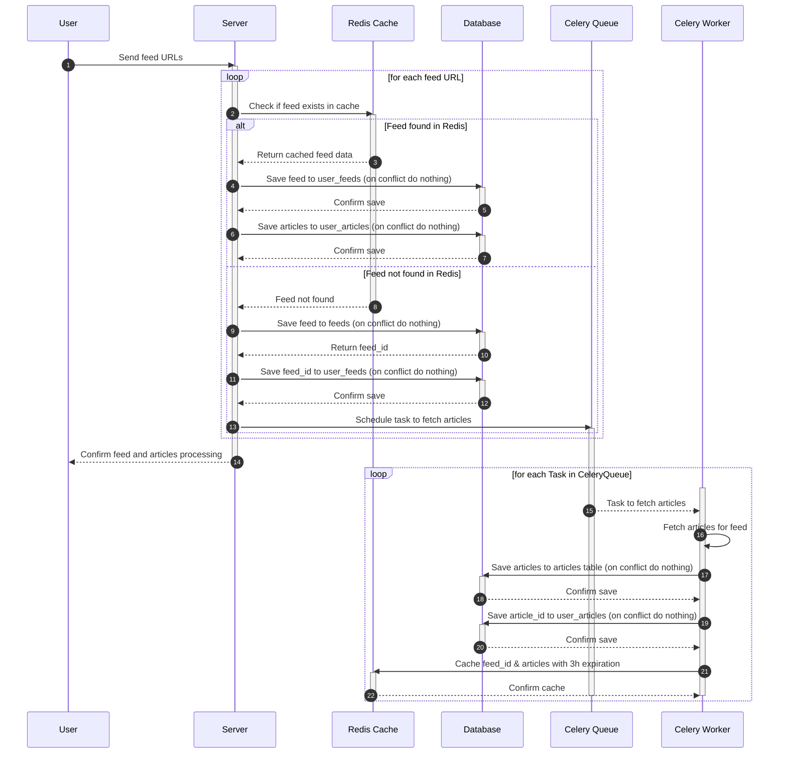

`/backend_api`
```sh
railway run bun run --hot src/index.ts
```

`/celery_worker`
> You will have to uncomment the `if __name__ == '__main__':` code in tasks.py to use this command

```sh
railway run python tasks.py
```

OR - _Preferably_

```sh
railway run celery --app=tasks worker -l INFO
```

## Sequence Diagram

1. User sends a request to the server to add feeds with array of URLs in JSON body
2. For Each feed(URL) the API server looks for it in Redis cache:
    1. If Found
        1. Retrieves articles from the cache which contains feed_id & article_id
        2. Saves the feed in the user_feeds table (on conflict do nothing)
        3. Saves the articles in the user_articles table (on conflict do nothing)
    2. If Not Found
        1. Saves the feed in feeds table (on conflict do nothing)
        2. Saves the feed_id in the user_feeds table (on conflict do nothing)
        3. Schedules a task in Celery queue to fetch the articles for the feed
3. Celery worker picks up the task
    1. It fetches the article for the feed
    2. Saves the articles to the articles table (on conflict gracefully fail task)
    3. Saves the article_id in user_arcticles table (on conflict gracefully fail task)
    4. Celery worker adds the feed_id & articles to a redis cache with 3 hours expiration time and `feed:{feed_url}` as key.


