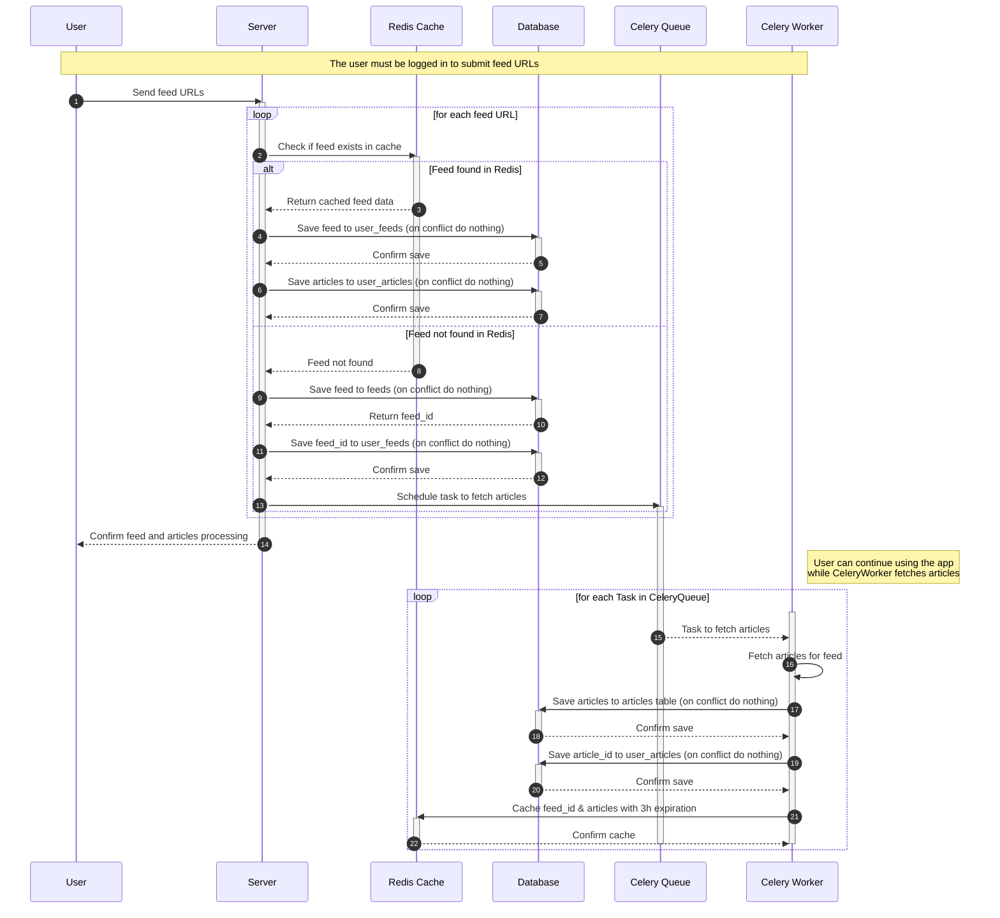
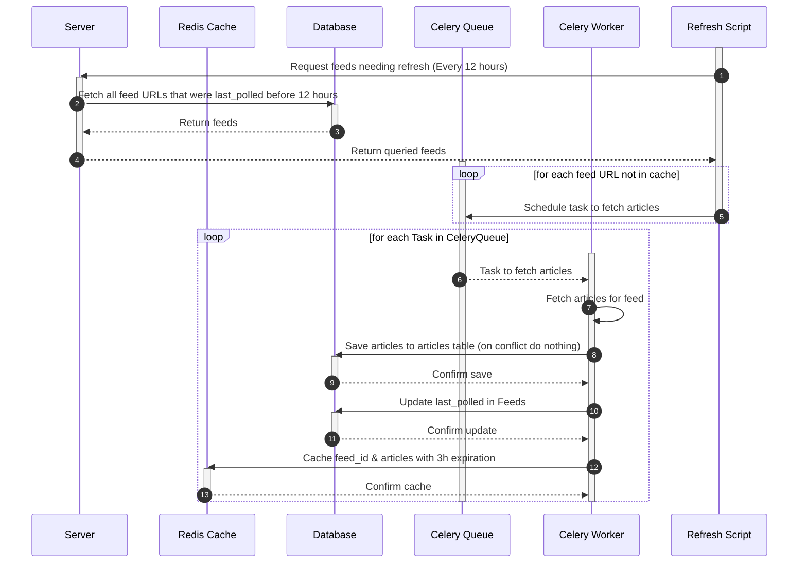

# Railway Proof Of Concept
## Railway, Bun, Hono, JWT, Typescript, Celery, Python, Redis, PostgresSQL

## Table of Contents
1. [About](#1-about)
2. [App Architecture](#2-app-architecture)
3. [Project Directories](#3-project-directories)
4. [How to Start?](#4-how-to-start)
5. [Railway 101](#5-railway-101)
6. [Railway Development](#6-railway-development)
7. [Railway Build and Deployment Config](#7-railway-build-and-deployment-config)
8. [Railway Build and Deployment Architecture](#8-railway-build-and-deployment-architecture)
9. [High Level Architecture](#9-high-level-architecture)
10. [Further Challenge](#10-further-challenge)

## 1. About
I created this POC to demonstrate leveraging various features of Railway during development, building, and deployment. There are significant room for improvement in the POC, but the focus is to demonstrate the use of Railway to boost developer productivity.

This is an RSS application. Where following basic API based operations are supported:
1. Healthcheck endpoint for service
2. User can register and login
3. User can add feeds to their profile
4. Redis is used as both cache server and celery queue
5. A celery task worker runs consistently to listen for new tasks in queue
6. Postgres is used as the persistance datastore
7. A simple cron script app that can use Railway's CRON to run on fixed schedule and query internal services via API endpoint.

## 2. App Architecture


## 3. Project Directories

| Directories | Purpose | Readme |
| ------ | ------ | ------ |
| backend_api | API Server built using Bun and Hono (Node.JS) | [README.md](/backend_api/README.md) |
| celery_worker | Celery Worker written in Python | [README.md](/celery_worker/README.md) |
| database | Contains the database schema | [README.md](/database/README.md) |
| internal_service | A simple internal API server using Bun | [README.md](/internal_service/README.md) |
| refresh_script | Cron script that calls the simple internal API server | [README.md](/refresh_script/README.md) |
| img | Contains the images used in this README | |

## 4. How to Start?
For more commands, refer to the `package.json` of each project.

`/backend_api`
```sh
railway run bun run --hot src/index.ts
```

`/celery_worker`
```sh
railway run celery --app=tasks worker -l INFO
```
OR 
> You will have to uncomment the `if __name__ == '__main__':` code in tasks.py to use this command

```sh
railway run python tasks.py
```

`/internal_service`
```sh
railway run bun run --hot index.ts
```

`/refresh_script`
```sh
railway run bun run --hot index.ts
```

## 5. Railway 101

This diagram will provide a clear picture of Railway's different features along with their hierarchy.


## 6. Railway Development

0. To see all railway cli commands:
```bash
railway --help
```

1. Navigate to your project root. In this repo, if working on backend_api, navigate to `/backend_api`. Then run:

```bash
railway link
# Select team > project > environment
```

Alternatively, you can use the project ID to link the project. Go to your Railway dashboard and click on “Setup project locally” from bottom left.

> You can also change the env later if needed using
```bash
railway environment
```

2. Create a service and add db variable and JWT secret to it in the Railway dashboard. To link the service to your local project, run:

```bash
railway service
```

3. To get a list of all available environment variables, run:

```bash
railway variables
```

4. Deploy Postgres and Redis services and use env variables to connect to them. You will need to add the Database connecion string variable to your service. You can get the connection string from the Railway dashboard.

5. To access the env variables in your local development, run:

```bash
railway run bun run --hot src/index.ts
```

6. To unlink the project from the Railway service, run:
```bash
railway unlink
```

## 7. Railway Build and Deployment Config
We're using `nixpacks.toml` and `railway.toml` to define build configs for our projects. Let's take a look at both files from `/backend_api`.

In `nixpacks.toml`, we have defined the setup and install phases. In the setup phase, we're installing nodejs and bun. In the install phase, we're installing the dependencies using bun.

`/backend_api/nixpacks.toml`
```toml
[phases.setup]
nixPkgs = ['nodejs', 'bun']

[phases.install]
cmds = ['bun install --production']
```

In `railway.toml`, we have defined the build and deploy configs. In the build config, we're using nixpacks to build the project. The watch pattern is set to trigger auto-deployment when we push new changes to the files in the specified watch path.

In the deploy config, we're using bun to start the server. We've defined a base deployment config, and a production environment deployment config. You can create as many as you want based on the environments you have created on Railway.

Most of the fields are self explanatory, for more details you can check out:
- [Railway Build Doc](https://docs.railway.app/deploy/builds)
- [Railway Config as Code](https://docs.railway.app/deploy/config-as-code)

```/backend_api/railway.toml```
```toml
[build]
builder = "nixpacks"
nixpacksConfigPath = "nixpacks.toml"
watchPatterns = ["src/**"]
buildCommand = "echo buildng!"

[deploy]
startCommand = "bun run src/index.ts"
healthcheckPath = "/healthcheck"
healthcheckTimeout = 100
restartPolicyType = "NEVER"

[environments.production.deploy]
numReplicas = 2
restartPolicyType = "ON_FAILURE"
restartPolicyMaxRetries = 3
```

## 8. Railway Build and Deployment Architecture
### Railway Build Process Flow Diagram


### Railway Deployment Process Flow Diagram


## 9. High Level Architecture
### Sequence Diagram

1. User sends a request to the server to add feeds with array of URLs in JSON body
2. For Each feed(URL) the API server looks for it in Redis cache:
    1. If Found
        1. Retrieves articles from the cache which contains feed_id & article_id
        2. Saves the feed in the user_feeds table (on conflict do nothing)
        3. Saves the articles in the user_articles table (on conflict do nothing)
    2. If Not Found
        1. Saves the feed in feeds table (on conflict do nothing)
        2. Saves the feed_id in the user_feeds table (on conflict do nothing)
        3. Schedules a task in Celery queue to fetch the articles for the feed
3. Celery worker picks up the task
    1. It fetches the article for the feed
    2. Saves the articles to the articles table (on conflict gracefully fail task)
    3. Saves the article_id in user_arcticles table (on conflict gracefully fail task)
    4. Celery worker adds the feed_id & articles to a redis cache with 3 hours expiration time and `feed:{feed_url}` as key.



## 10. Further Challenge

You can update `refresh_script` to suit following workflow:

> 1. Add last_polled to `feeds` table
> 2. Celery worker picks up the task -Add- Update last_polled in Feeds table

1. Independent Refresh Script (runs every 12 hours):
    1. Call the API server to retrieve all feed URLs that need refreshing.
        1. API server queries Redis to get the list of feed URLs currently cached.
        2. API server queries the database to fetch all feed URLs.
        3. API server filters out feed URLs that are already in Redis cache and returns the remaining URLs to the script.
    2. For each feed URL that needs refreshing, the script schedules a task in the Celery queue.
2. Celery Worker Processing:
    1. Upon picking up a task, the Celery worker fetches the latest articles for the provided feed URL.
    2. Save any new articles to the articles table. Handle conflicts gracefully, e.g., if an article with the same unique identifier already exists, skip/ignore or update as needed.
    3. Update last_polled in Feeds table
    4. Cache the feed ID and its respective articles in Redis with a key format like feed:{feed_url} and set a 3-hour expiration.


