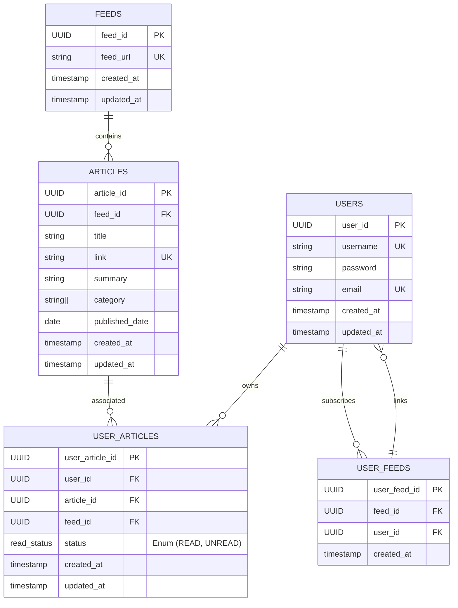

# ERD Diagram

```mermaid
erDiagram
    FEEDS ||--o{ ARTICLES : contains
    FEEDS {
        UUID feed_id PK
        string feed_url UK
        timestamp created_at
        timestamp updated_at
    }
    ARTICLES ||--o{ USER_ARTICLES : associated
    ARTICLES {
        UUID article_id PK
        UUID feed_id FK
        string title
        string link UK
        string summary
        string[] category
        date published_date
        timestamp created_at
        timestamp updated_at
    }
    USERS ||--o{ USER_FEEDS : subscribes
    USERS {
        UUID user_id PK
        string username UK
        string password
        string email UK
        timestamp created_at
        timestamp updated_at
    }
    USER_FEEDS ||--o{ USERS : links
    USER_FEEDS {
        UUID user_feed_id PK
        UUID feed_id FK
        UUID user_id FK
        timestamp created_at
    }
    USERS ||--o{ USER_ARTICLES : owns
    USER_ARTICLES {
        UUID user_article_id PK
        UUID user_id FK
        UUID article_id FK
        UUID feed_id FK
        read_status status "Enum (READ, UNREAD)"
        timestamp created_at
        timestamp updated_at
    }
```
